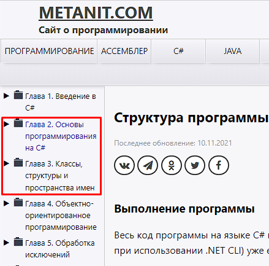

# Начало работы с Visual Studio и .Net

## Алгоритм работы
1. Установить Visual Studio и создать консольное приложение на языке C#. Подробнее - https://metanit.com/sharp/tutorial/1.2.php
2. Почитать про основы языка C#. Сайт Metanit https://metanit.com/sharp/tutorial/1.5.php, разделы 2-3.
Одновременно с прочтением статей тренироваться писать код в созданном приложении, запускать приложение, проверять результаты работы. 

3. Написать и предоставить на проверку консольное приложение по следующим требованиям:
код должен содержать следующие инструкции: if else, switch, for, foreach, while.
   - if else: пользователи вводит число, программа проверяет, является ли это число больше 100 и выводит ответ в консоль.
   - switch: предложить пользователю ввести число от 1 до 7, и вывести в консоль наименование дня недели соответствующее этому числу.
   - for: предложить пользователю ввести число, указывающее сколько раз нужно вывести текст "Привет мир!" в консоль. И вывести в консоль "Привет мир!" в соответствии с числом введенным пользователем.
   - foreach: предложить пользователю ввести число, указывающее размер массива. Создать массив целых чисел указанного размера (заполнить массив случайными числами). И вывести содержимое массива в консоль.
   - while: создать игру, в которой загадывается число от 1 до 100. Пользователь должен угадать это число, после каждой попытки программа должна сообщать является введенное число больше, меньше загаданного числа или пользователь угадал и выиграл.

Алгоритм работы приложения: Пользователь запускает приложение -> Открывается консольное приложение -> На экране консоли отображается текст:
<pre><code>Для вызова выполняемой подпрограммы укажите ее номер и нажните Enter:
1 - if else
2 - switch
3 - for
4 - foreach
5 - while
</code></pre>

Пользователь вводит число и попадает в "подпрограмму", реализованную в пункте 3.

Приложение разрабатывать в репозитории "my_project" отдельной ветке с именем "Work 2" (создай отдельную папку для приложения).
По готовности ветку запушить в удаленный репозиторий.

Как только приложение будет готово - написать о том, что можно проверять.
